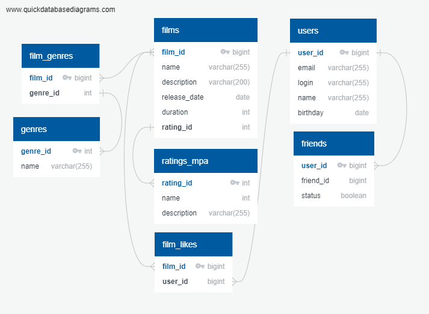

# java-filmorate

### Модель базы данных представлена на ER-диаграмме

---


### Примеры запросов в базу данных

---

<details>
  <summary>Получить фильм с id=2</summary>

```sql
    SELECT *
    FROM films
    WHERE film_id = 2;
```

</details>  

<details>
  <summary>Получить пользователя с id=5</summary>

```sql
    SELECT *
    FROM users
    WHERE user_id = 5;
```

</details>  
